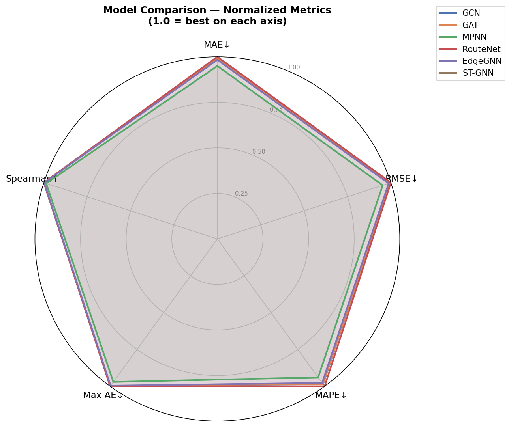
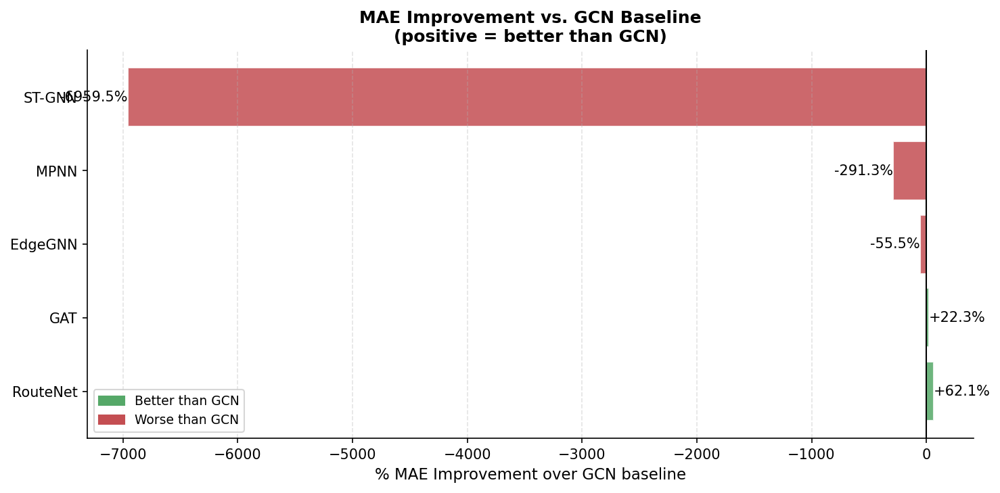
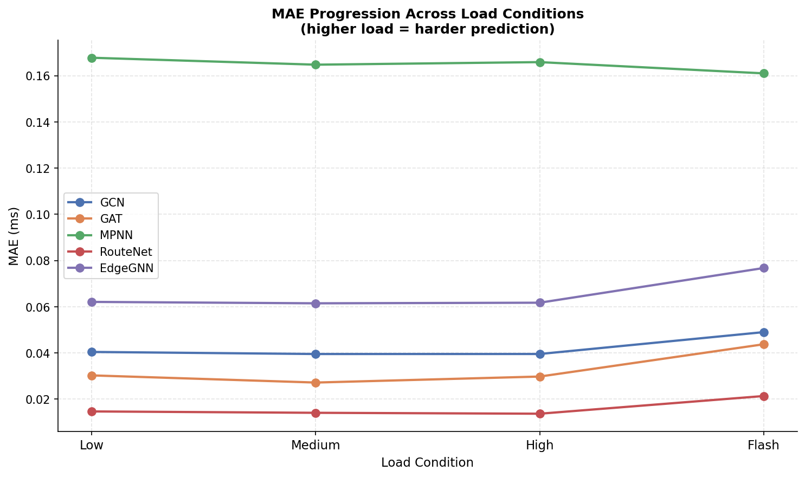
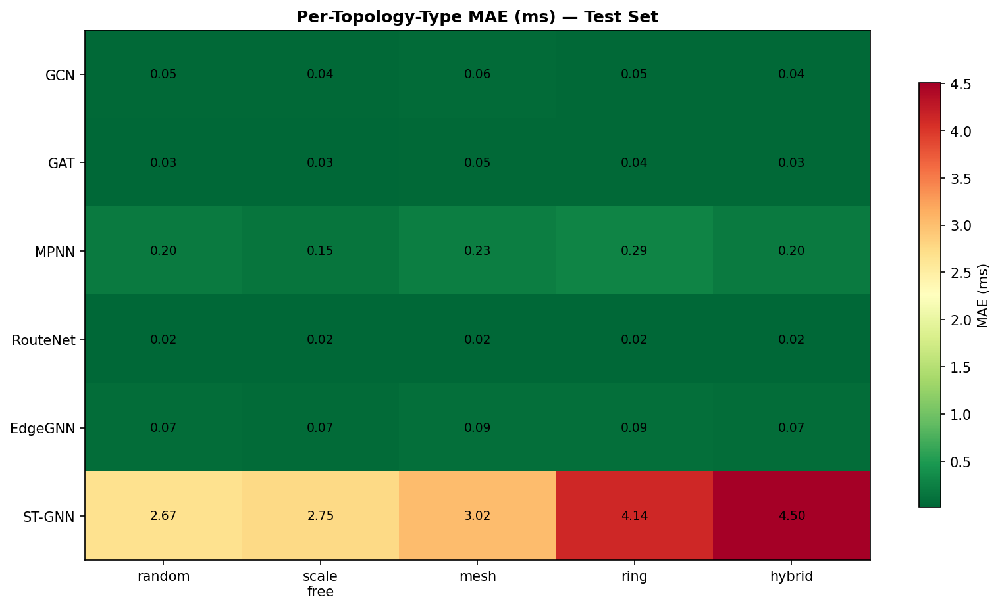
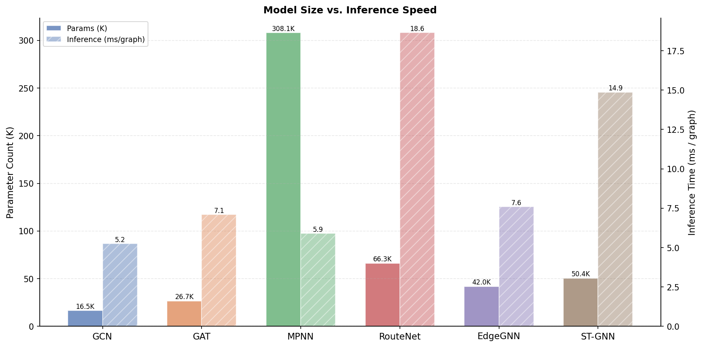
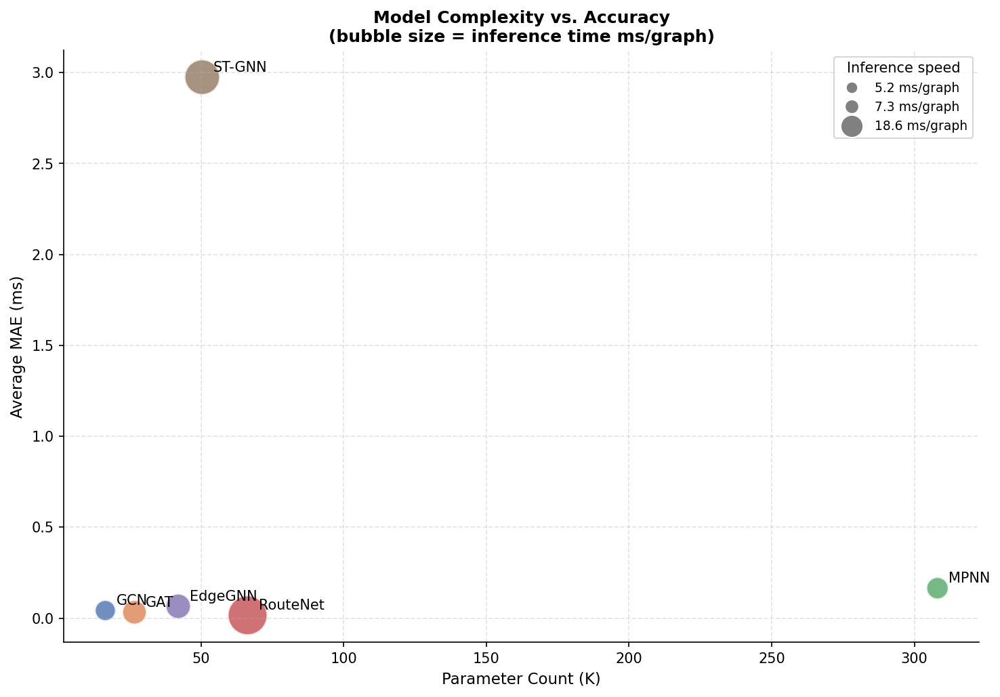

# GNNs for Multi-Domain Routing Optimization

A Graph Neural Network (GNN) framework for predicting per-link latency in multi-domain computer networks under varying traffic loads. The project trains and benchmarks multiple GNN architectures on synthetic network topologies, enabling intelligent routing decisions without real-time simulation.

---

## Table of Contents

1. [Project Overview](#project-overview)
2. [Team Structure](#team-structure)
3. [Repository Layout](#repository-layout)
4. [Models](#models)
5. [Benchmark Results](#benchmark-results)
6. [Dataset](#dataset)
7. [Installation](#installation)
8. [Running the Pipeline](#running-the-pipeline)
9. [Training & Evaluation](#training--evaluation)
10. [Feature Specifications](#feature-specifications)
11. [Project Reports](#project-reports)

---

## Project Overview

Networks are modelled as graphs where **routers are nodes** and **physical links are edges**. Each model predicts the per-edge latency (in milliseconds) under four distinct traffic load conditions:

| Index | Load Condition | Utilization |
|:---:|:---|:---:|
| 0 | Low | 20% |
| 1 | Medium | 50% |
| 2 | High | 80% |
| 3 | Flash (burst) | 95% |

Ground-truth labels are computed using the **M/M/1 queueing model** across 500 synthetic network topologies spanning 5 topology types.

---

## Team Structure

| Group | Role | Key Deliverables |
|---|---|---|
| **Group 3** | Topology generation & ground-truth labelling | Raw topology files (JSON, GraphML, CSV), static latency labels, temporal snapshots |
| **Group 11** | Feature engineering, traffic simulation & dataset assembly | Processed feature arrays (`.npy`), traffic matrices, enriched labels, PyG dataset |

---

## Repository Layout

```
.
├── src/
│   ├── group3/                         # Topology generation pipeline
│   │   ├── topology_gen/               # Topology generators (random, scale-free, mesh, ring, hybrid)
│   │   ├── domain_modeling/            # Traffic simulation with diurnal patterns & flash crowds
│   │   ├── labeling/                   # M/M/1 & M/G/1 latency computation, exporters
│   │   └── scripts/
│   │       ├── generate_dataset.py     # Main entry point for Group 3
│   │       └── validate_dataset.py     # Dataset validation utility
│   └── group11/                        # Feature engineering & model training pipeline
│       ├── generate_mock_data.py       # Mock topology generator (dev/test)
│       ├── feature_engineering/
│       │   └── build_features.py       # Phase A: node/edge/global feature extraction
│       ├── traffic_simulation/
│       │   └── simulate_traffic.py     # Phase B: traffic demand matrices
│       ├── ground_truth/
│       │   └── enrich_labels.py        # Phase C: end-to-end path latency enrichment
│       ├── dataset_assembly/
│       │   ├── assemble_dataset.py     # Phase D: assemble PyG dataset
│       │   └── augment_dataset.py      # Dataset augmentation utilities
│       ├── models/
│       │   ├── gcn.py                  # GCN baseline
│       │   ├── gat.py                  # Graph Attention Network
│       │   ├── mpnn.py                 # Message Passing Neural Network
│       │   ├── routenet_fermi.py       # RouteNet-Fermi (best performer)
│       │   ├── edge_gnn.py             # EdgeGNN (custom architecture)
│       │   └── temporal_gnn.py         # Spatio-Temporal GNN
│       └── training/
│           ├── train.py                # Single-model training script
│           ├── train_all_peak.py       # Train all models sequentially
│           ├── benchmark.py            # Benchmarking utilities
│           ├── comprehensive_benchmark.py  # Full benchmark suite
│           ├── evaluate.py             # Evaluation metrics
│           └── visualize.py            # Result visualisation
├── data/
│   ├── raw/                            # Group 3 output (topologies, labels, snapshots)
│   └── processed/
│       ├── features/                   # Per-topology .npy feature arrays
│       ├── traffic/                    # Traffic demand matrices
│       ├── labels/                     # Enriched path latency labels
│       ├── dataset/                    # Assembled PyG dataset (.pt files)
│       └── checkpoints/                # Saved model weights (.pt)
├── docs/                               # Reports, benchmark results, figures
├── tests/
│   └── validate_group11.py             # End-to-end validation suite
├── IAP_TermProject/                    # LaTeX term project report
├── requirements.txt
└── run_commands.txt                    # All runnable commands with descriptions
```

---

## Models

Six GNN architectures are implemented and benchmarked:

| Model | Class | File | Description |
|---|---|---|---|
| **GCN** | `GCNLatencyPredictor` | `models/gcn.py` | Baseline — uniform neighbour aggregation via GCNConv |
| **GAT** | `GATLatencyPredictor` | `models/gat.py` | Attention-weighted aggregation (4 heads); better on heterogeneous topologies |
| **MPNN** | `MPNNLatencyPredictor` | `models/mpnn.py` | Explicit edge-conditioned message passing with GRU state updates |
| **RouteNet-Fermi** | `RouteNetFermi` | `models/routenet_fermi.py` | Path-aware model; best overall performance |
| **EdgeGNN** | `EdgeGNNLatencyPredictor` | `models/edge_gnn.py` | Custom dual-stream node+edge representation learning |
| **ST-GNN** | `SpatioTemporalGNN` | `models/temporal_gnn.py` | Temporal model with GRU over 12-timestep snapshots |

### Shared Input Schema

All models consume a PyTorch Geometric `Data` object:

| Field | Shape | Description |
|:---|:---:|:---|
| `x` | `(N, 12)` | Node features |
| `edge_index` | `(2, M)` | COO-format edge connectivity |
| `edge_attr` | `(M, 5)` | Edge features |
| `u` | `(1, 11)` | Global topology-level features |
| `y_edge` | `(M, 4)` | Per-edge latency targets (training only) |

---

## Benchmark Results

Results on the full 500-topology test set:

| Model | MAE (ms) | RMSE (ms) | R² | MAPE (%) | Spearman ρ | Params | Inference (ms/graph) |
|:---|:---:|:---:|:---:|:---:|:---:|:---:|:---:|
| **RouteNet** | **0.0160** | **0.0236** | **0.9999** | **0.50** | **0.9999** | 66,340 | 18.6 |
| GAT | 0.0328 | 0.0644 | 0.9993 | 1.48 | 0.9997 | 26,692 | 7.1 |
| GCN | 0.0421 | 0.0704 | 0.9992 | 1.39 | 0.9998 | 16,484 | 5.2 |
| EdgeGNN | 0.0655 | 0.1073 | 0.9982 | 1.94 | 0.9990 | 42,021 | 7.6 |
| MPNN | 0.1649 | 0.3324 | 0.9830 | 4.27 | 0.9929 | 308,068 | 5.9 |
| ST-GNN | 2.9748 | 6.5846 | 0.7272 | 63.04 | 0.4690 | 50,433 | 14.9 |

> All GAT, MPNN, RouteNet, EdgeGNN, and ST-GNN results are statistically significantly better than GCN (Wilcoxon signed-rank test, p < 0.05).

**RouteNet-Fermi** achieves the best performance across all metrics with R² = 0.9999 and MAE of 0.016 ms, making it the recommended model for production use.

### Normalized Model Comparison (Radar Chart)



Each axis is normalized so that 1.0 = best on that metric. GCN, GAT, MPNN, RouteNet, EdgeGNN, and ST-GNN are overlaid. RouteNet and GAT dominate; ST-GNN lags on all axes.

### MAE Improvement over GCN Baseline



RouteNet achieves **+62.1%** improvement over GCN. ST-GNN and MPNN are significantly worse than the baseline due to their sensitivity to non-stationary and bursty traffic patterns.

### MAE Across Load Conditions



All models degrade slightly at flash-crowd load (95% utilization) where M/M/1 latency becomes highly nonlinear. ST-GNN is excluded here for scale clarity.

### Per-Topology-Type MAE Heatmap



ST-GNN struggles most on ring and hybrid topologies (MAE > 4 ms). All other models perform consistently across topology types (MAE < 0.1 ms).

### Model Size vs. Inference Speed



MPNN has the most parameters (308K) yet is not the slowest — RouteNet's path enumeration makes it the slowest at 18.6 ms/graph despite its 66K parameters.

### Model Complexity vs. Accuracy



Bubble size encodes inference time. RouteNet occupies the lower-left ideal region — low MAE, moderate parameter count — while ST-GNN sits in the worst quadrant (high MAE, slow inference).

---

## Dataset

### Topology Types

| Type | Count | Node Range | Description |
|---|:---:|:---:|:---|
| Random | 150 | 10–100 | Erdős–Rényi random graphs |
| Scale-Free | 100 | 20–100 | Barabási–Albert preferential attachment |
| Mesh | 100 | 10–100 | High-connectivity grid-like graphs |
| Ring | 75 | 10–100 | Circular topology — exactly 2 paths per pair |
| Hybrid | 75 | 20–100 | Scale-free core with ring periphery |

Each topology has **2–5 AS-like domains**. Latency ground truth is computed via M/M/1 queuing under 4 load conditions. 12 temporal snapshots per topology capture diurnal traffic patterns and flash-crowd events.

### Dataset Files

| File | Description |
|---|---|
| `data/processed/dataset/gnn_dataset.pt` | Main PyG dataset (500 `Data` objects) |
| `data/processed/dataset/temporal_dataset.pt` | Temporal version with 12-step snapshots |
| `data/processed/dataset/dataset_index.json` | Metadata index (topology ID, node/edge counts, type) |
| `data/processed/checkpoints/*.pt` | Pre-trained model weights for all 6 models |

> `routenet_dataset.pt` (113 MB) exceeds GitHub's file size limit and is excluded from version control. Regenerate it by running the full pipeline.

---

## Installation

```bash
# 1. Clone the repository
git clone https://github.com/code-Harsh247/GNNs-for-Multi-Domain-Routing-Optimization.git
cd GNNs-for-Multi-Domain-Routing-Optimization

# 2. Install core dependencies (PyTorch, PyG, NumPy, NetworkX, etc.)
pip install -r requirements.txt

# 3. Install Group 3 extra dependencies
pip install -r src/group3/requirements.txt
```

> **GPU users:** Replace the `torch`/`torchvision`/`torchaudio` lines in `requirements.txt` with the appropriate CUDA-enabled build from [pytorch.org](https://pytorch.org/get-started/locally/).

---

## Running the Pipeline

All commands are run from the repository root.

### Quick Dev/Test (5 mock topologies)

```bash
python src/group11/generate_mock_data.py
python src/group11/feature_engineering/build_features.py
python src/group11/traffic_simulation/simulate_traffic.py
python src/group11/ground_truth/enrich_labels.py
python src/group11/dataset_assembly/assemble_dataset.py
python tests/validate_group11.py
```

### Full Production Run (500 topologies)

```bash
# Step 1 — Generate raw dataset (Group 3)
python src/group3/scripts/generate_dataset.py

# Step 2 — Validate raw dataset (optional)
python src/group3/scripts/validate_dataset.py

# Step 3 — Feature engineering (Phase A)
python src/group11/feature_engineering/build_features.py

# Step 4 — Traffic simulation (Phase B)
python src/group11/traffic_simulation/simulate_traffic.py

# Step 5 — Enrich ground truth labels (Phase C)
python src/group11/ground_truth/enrich_labels.py

# Step 6 — Assemble GNN dataset (Phase D)
python src/group11/dataset_assembly/assemble_dataset.py

# Step 7 — Validate all outputs
python tests/validate_group11.py
```

### Dataset Generation Options

```bash
# Smoke test — 5 topologies, 4 timesteps
python src/group3/scripts/generate_dataset.py --num-topologies 5 --min-nodes 10 --max-nodes 30 --timesteps 4 --no-distribution --output-dir outputs/smoke_dataset

# M/G/1 queueing model variant
python src/group3/scripts/generate_dataset.py --queue-model mg1

# Higher flash-crowd probability
python src/group3/scripts/generate_dataset.py --flash-crowd-prob 0.20
```

---

## Training & Evaluation

### Train a single model

```bash
python src/group11/training/train.py
```

### Train all models sequentially

```bash
python src/group11/training/train_all_peak.py
```

### Run the full benchmark suite

```bash
python src/group11/training/comprehensive_benchmark.py
```

Benchmark results are saved to `docs/benchmark_results.csv` and `docs/benchmark_results.json`. Visualisations are generated by:

```bash
python src/group11/training/visualize.py
```

Pre-trained checkpoints for all 6 models are available in `data/processed/checkpoints/`.

---

## Feature Specifications

### Node Features — `x` shape `(N, 12)`

| Index | Feature | Range | Description |
|:---:|:---|:---:|:---|
| 0–2 | `router_type` (one-hot) | {0, 1} | core / edge / gateway |
| 3 | `capacity_mbps_norm` | [0.1, 1.0] | Router capacity / 1000 Mbps |
| 4 | `x_coord` | [0.0, 1.0] | Normalised geographic x position |
| 5 | `y_coord` | [0.0, 1.0] | Normalised geographic y position |
| 6–10 | `domain_id` (one-hot) | {0, 1} | AS domain membership (5 slots) |
| 11 | `degree_norm` | [0.0, 1.0] | Node degree / max degree in topology |

### Edge Features — `edge_attr` shape `(M, 5)`

| Index | Feature | Range | Description |
|:---:|:---|:---:|:---|
| 0 | `bandwidth_mbps_norm` | [0.01, 1.0] | Link bandwidth / 1000 Mbps |
| 1 | `propagation_delay_ms_norm` | [0.01, 0.2] | Propagation delay / 100 ms |
| 2 | `is_inter_domain` | {0, 1} | 1 if link crosses domain boundary |
| 3 | `link_reliability` | [0.95, 1.0] | Link reliability score |
| 4 | `cost_norm` | [0.0, 1.0] | Link cost / max cost in topology |

### Global Features — `u` shape `(1, 11)`

| Index | Feature | Description |
|:---:|:---|:---|
| 0 | `num_nodes_norm` | Node count / 100 |
| 1 | `num_edges_norm` | Edge count / 500 |
| 2 | `num_domains_norm` | Domain count / 5 |
| 3 | `avg_bandwidth_norm` | Mean bandwidth / 1000 |
| 4 | `avg_propagation_delay_norm` | Mean propagation delay / 100 |
| 5 | `inter_domain_ratio` | Fraction of inter-domain edges |
| 6–10 | `topology_type` (one-hot) | random / scale_free / mesh / ring / hybrid |

---

## Project Reports

| Document | Description |
|---|---|
| [docs/phase1_report.md](docs/phase1_report.md) | Full Phase 1 technical report |
| [docs/summary.md](docs/summary.md) | Project summary and pipeline overview |
| [docs/models.md](docs/models.md) | Detailed model architecture documentation |
| [docs/data_card.md](docs/data_card.md) | Dataset feature card for model developers |
| [docs/benchmark_results.csv](docs/benchmark_results.csv) | Raw benchmark metrics |
| [IAP_TermProject/Main.tex](IAP_TermProject/Main.tex) | LaTeX source for the term project paper |
